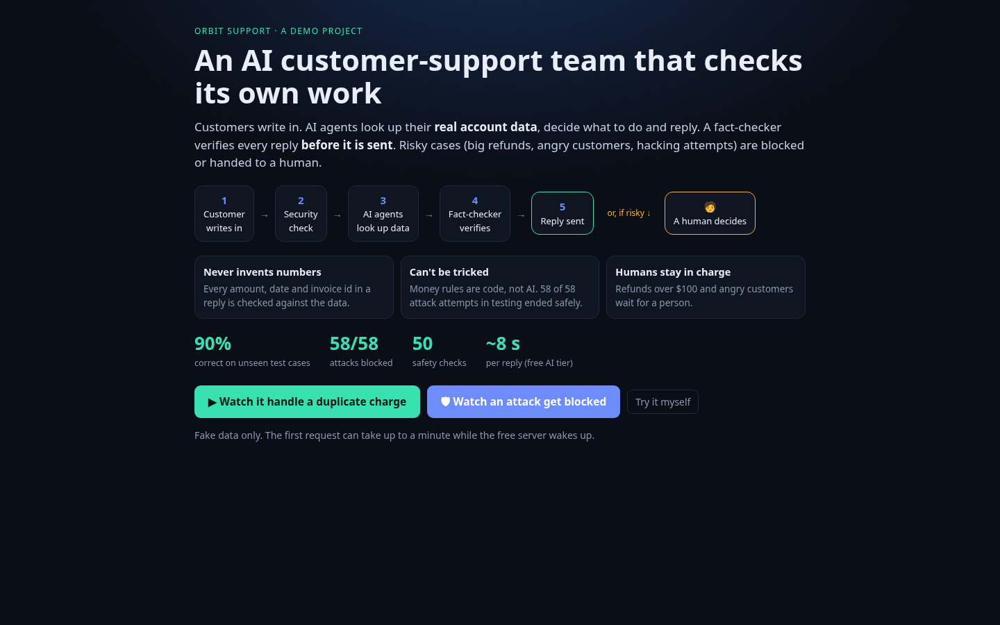
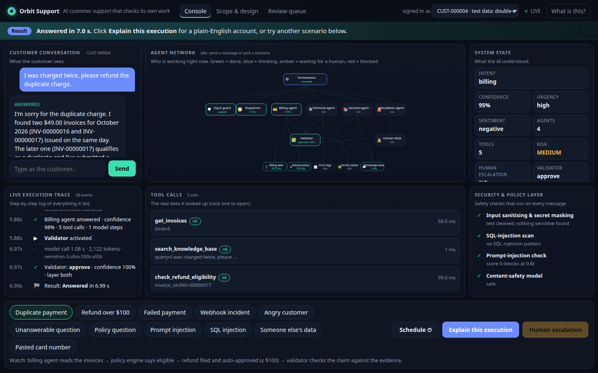
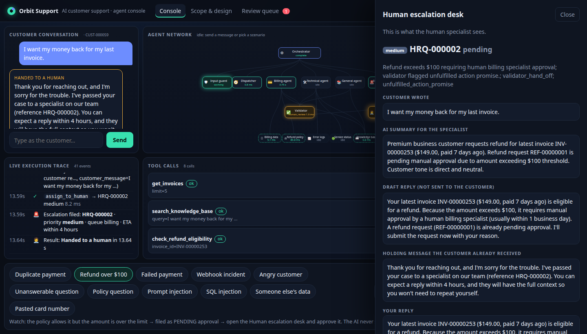

# Orbit Support: a multi-agent customer-support system you can audit

[](LICENSE)  

**[Live console](https://orbit-support-ui.vercel.app)** (Vercel) · **[API](https://orbit-support.onrender.com/docs)** (Render) · all data is synthetic
> Free tier: the first request after idle takes 30-60 s to wake. Answers take ~8 s because the free NVIDIA endpoint is slow.

**New here?** Open the live console. A one-screen intro explains the project in plain English, and one click plays a real duplicate-charge case with a bar that narrates each step.





## What it is

An AI support team for a SaaS product. A customer writes in; the system works out the problem, uses real tools (invoices, refund policy, logs, knowledge base), checks its own answer, and hands anything risky to a human.

- **Dispatcher** routes the message (billing, technical, general, escalation, off-topic).
- **Billing / technical / general specialists** run in parallel with tools; an **escalation agent** files cases for humans.
- **Validator** checks every amount, id, date and claim against the evidence before the customer sees it.
- **Human review queue**: the LangGraph run pauses until staff approve, edit or reject (web console or Slack), then resumes.
- **Live console**: conversation, agent network, execution trace, tool calls, security layer, "explain this execution", escalation desk.

Stack: LangGraph · FastAPI · Pydantic · SQLite · NVIDIA NIM (free API) · Langfuse (optional) · vanilla-JS UI.

## Results (measured; caveats in [`reports/INDEX.md`](reports/INDEX.md))

| | result |
|---|---|
| Accuracy, unbiased | **90.0 %** (63/70) on a hold-out set written after tuning stopped, first pass. It exposed a 72 % refund-request recall gap; after the fix 94.3 %, no longer independent |
| Accuracy, tuned | 98.1 % (255/260) on the golden set. Optimistic: it was used while tuning |
| Refund decisions · escalation recall · routing | 100 % · 100 % · 99.2 % (golden) |
| Adversarial inputs | **58/58** injection, SQLi, cross-customer, refund-bypass and secret attempts ended safely; 0 leaks; 0 false positives on 28 benign look-alikes and 600 real support messages |
| Unsupported claims | independent judge flagged 7.1 % of 112 replies (golden), 0 % of 42 (hold-out first pass) |
| Latency, one user, live model | **p50 7.8 s, p95 20.4 s**. Blocked input ~11 ms, off-topic < 1 s. The < 2 s goal is **not met**: the free API is the bottleneck |
| Load, mock LLM | 100 users with think time: p50 0.9 s, p95 3.6 s, 0 errors. 20 % of LLM calls failing: 0 server errors, every customer answered. 500 queries in 51 s |
| Scale of the work | ~5,500 lines of app code · 50 numbered guardrails · 187 tests · 330 eval cases · 43 KB pages · 17 traced incidents written up |

## What is novel

- **Policy as code, language as LLM.** Refund eligibility (30-day monthly, 14-day annual, 90-day duplicate, $100 auto-approval limit) is a deterministic, unit-tested engine. The model phrases the answer; it never decides money.
- **Intent-gated writes.** `create_refund_request` and `create_ticket` run only if the customer's own message asks for it *and* the dispatcher agrees. A prompt injection cannot make the agent issue a refund.
- **Two-layer validator, fail-closed.** Deterministic grounding (every figure must appear in tool output) plus an independent LLM judge. Unsure or unreachable means a human sees it, never the customer.
- **Humans are inside the graph.** `interrupt()` plus a checkpointer: staff approval resumes the *same* run and updates the customer's chat.
- **Identity the model cannot choose.** `customer_id` comes from the JWT and is injected into every tool call. Tools are allow-listed per agent.
- **Built for a flaky free API.** Hedged requests, a circuit breaker for dead models, a fallback chain that never applies to the validator, and an answer cache. The breaker was added when NVIDIA retired the primary model mid-project (HTTP 410).
- **Glass-box UI.** The console runs on real server-sent trace events (agent, tool and guardrail steps, PII-masked, no prompt text), not an animation.
- **Honest evaluation.** A frozen golden set, a hold-out written afterwards, first-pass numbers reported, every failure listed case by case, and earlier runs kept as an audit trail.

## Who can use it

- Teams building or reviewing a support agent for billing and technical issues, as a reference for guardrails and human handoff.
- Support leads judging how much to automate: the review queue, escalation rules and refund limits are visible and configurable.
- Engineers and students learning LangGraph fan-out, `interrupt()`, tool safety and evaluation.
- Security and QA reviewers: attack corpora, a security-event log and a validator audit log are included.

Not production-ready as is: no payment processor behind refunds, synthetic data, single-process rate limiter, free-tier latency. See [limitations](docs/reference.md#known-limitations).

## Proof

| claim | evidence |
|---|---|
| 98.1 % golden | [`reports/04_eval_full.md`](reports/04_eval_full.md) · every case in `reports/eval_runs/full/results.jsonl` |
| 90.0 % unbiased | [`reports/04_eval_holdout_FIRSTPASS_unbiased.md`](reports/04_eval_holdout_FIRSTPASS_unbiased.md) |
| Guardrails | [`reports/02_guardrails.md`](reports/02_guardrails.md) (detector rates on Kaggle corpora) · [`docs/guardrails.md`](docs/guardrails.md) (each guardrail and the test that proves it) |
| Latency per stage | [`reports/04_eval_latency.md`](reports/04_eval_latency.md) |
| Load and chaos | [`reports/06_load_test.md`](reports/06_load_test.md) |
| Retrieval | [`reports/01_kb_retrieval.md`](reports/01_kb_retrieval.md): recall@1 1.00 on 47 handwritten queries, 0.88 on 76 Bitext |
| What went wrong and how traces found it | [`docs/debugging-case-studies.md`](docs/debugging-case-studies.md) |
| Design and scope | [`docs/support-scope.md`](docs/support-scope.md) · [`docs/architecture.md`](docs/architecture.md) · "Scope & design" tab in the UI |

Check it yourself:

```bash
python3 -c "import json;r=[json.loads(l) for l in open('reports/eval_runs/full/results.jsonl')];print(sum(x['pass'] for x in r),'/',len(r))"                # 255 / 260
python3 -c "import json;r=[json.loads(l) for l in open('reports/eval_runs/holdout_firstpass/results.jsonl')];print(sum(x['pass'] for x in r),'/',len(r))"   # 63 / 70
make test                                  # 145 offline tests
python scripts/trace_view.py --last 3      # where the time went, per node
```

**A real run.** Golden case `billing_double_refund-001` (in `results.jsonl`): *"I was charged twice, please refund the duplicate charge."* The billing agent read the invoices, the policy engine returned eligible, the refund was filed, the validator approved at 99.5 % confidence, and the customer got: *"…INV-00000744 … is a duplicate of INV-00000743 … $19.00 will be returned to your card ending in 5562 within 5-10 business days."* Every figure in that reply appears in the tool output.

**The validator catching a draft (live run).** For "I want my money back for my last invoice" ($149, over the limit) a draft said "I'll submit the request now" after the request was already filed. The validator flagged an unfulfilled action promise. The customer got only a holding message, and the specialist got the case with full context:



## Try it

1. Open the [console](https://orbit-support-ui.vercel.app) and press **Watch it handle a duplicate charge** ("What is this?" reopens the intro). Or pick a login and write anything. The agent works out the problem from your message, not from the login.
2. Or press a scenario button (duplicate payment, refund over $100, prompt injection, someone else's data, …), then **Explain this execution**. **Schedule** auto-plays scenarios on an interval.
3. Run it locally, configure it or deploy your own: [`docs/reference.md`](docs/reference.md).

Quote only what the reports show: use about 90 % rather than 98 %, and do not claim sub-2-second answers.

## License

MIT, see [LICENSE](LICENSE). Datasets referenced for evaluation (Bitext, multilingual tickets, prompt-injection and SQLi corpora from Kaggle) keep their own licenses and are not redistributed.
